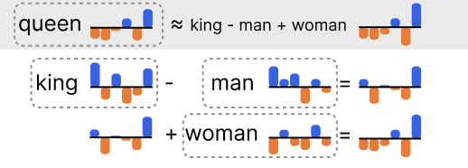

# Concepts: embeddings

A base level of understanding about _embeddings_ will help you more effectively work with Semantra. At its core, embeddings are numerical representations of meaning. And embedding models are machine learning models that take in text (or other media) and output these numerical embeddings.

Text embedding models are typically trained on terabytes of text encompassing many genres. From that data they become skilled at encoding text into meaning by inferring patterns.

Semantra provides easy access to working with embedding models. Working with embeddings in Semantra is like _sculpting_ in the domain of meaning.

Embeddings can be hundreds or even thousands of dimensions long — it varies by model. While it's hard to visualize multi-dimensional space, embeddings can be thought of like bar charts, where each dimension is a bar.

Since embeddings are entirely numerical, you can do mathematical operations on them, with some pretty fun results. For example, if you take the embedding for `queen`, `king`, `woman`, and `man`, you can do arithmetic like `king - man + woman` and end up with a result that's pretty close to the embedding for `queen`.

In the diagram above, the embeddings for `queen`, `king`, `man`, and `woman` are shown as simplified bar charts with six dimensions. Embeddings are added and subtracted bar by bar (in the diagram, positive bars are blue and negative bars are orange).

With only six dimensions, we can still represent many concepts. The last bar in `king` and `queen` looks similar so might encode concepts like _royalty_. The fourth and fifth bars in `man` and `woman` are similar and might represent _human_. The first bars in `king` and `man` are similar along with the first bars in `queen` and `woman` and so could encode the concept of _gender_.

Modern embedding models give us hundreds of dimensions, which means we can express complex and nuanced relationships between concepts. This kind of analogizing with embedding math over high-dimensional conceputal encodings opens up powerful implications for semantic search. Semantra allows performing basic arithmetic in the search bar and also adding/subtracting search results to finely shape your query and find specific results.

See [lesson 2 of the tutorial](lesson_2_advanced_searching.md) for a walkthrough of some of these advanced features.
