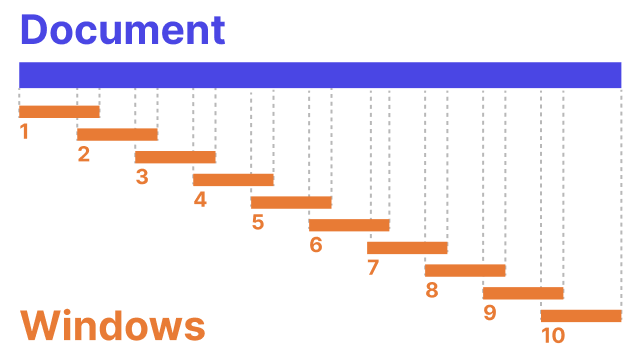
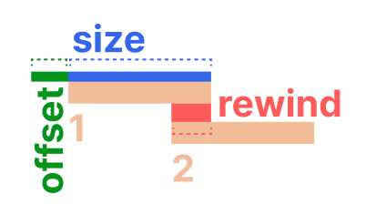

# Concepts: windows

When Semantra processes your text, it slices it up into smaller chunks called _windows_. It is useful to know about this process in case you want to alter the windows to explore semantic search on smaller or larger bits of context.

## How it works

By default, Semantra chunks a document into slightly overlapping windows:

In the diagram above, the document is chunked into 10 windows with a slight overlap. The overlap is useful to ensure content at the edges of windows doesn't get split up in a way that affects search and retrieval.

There are three parameters that control Semantra's windowing process:

- **size**: the size of each window in tokens (which roughly correspond to a word)
- **offset**: the initial offset of the window in the document. This is usually 0, which corresponds to starting at the beginning of the document
- **rewind**: how many tokens to go back by before the start of the next window. This factor controls how big the overlap is. Setting rewind to 0 will result in non-overlapped windows.

## The default parameters

The default for Semantra is to use a window size of 128 with a rewind factor of 16 and no offset. This has been found anecdotally to be pretty good and work well across a wide range of models.

Feel free to experiment with other sizes and overlaps depending on your needs.
