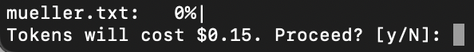
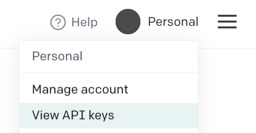
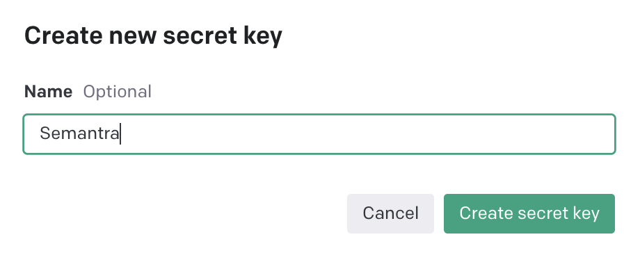
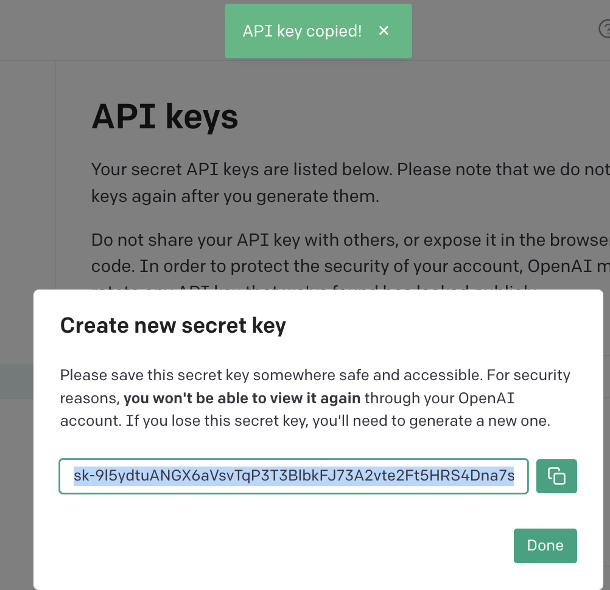

# Using OpenAI with Semantra

[OpenAI](https://openai.com/) has a state-of-the-art embedding model that can be used with Semantra with a little bit of setup.

The current [model](https://platform.openai.com/docs/models/embeddings) OpenAI recommends, `text-embedding-ada-002`, currently [costs](https://openai.com/pricing#embedding-models) $0.0004 / 1,000 tokens, where a token is roughly 3/4 of a word.

With Semantra's default overlapping window, we can simplify this as roughly costing $0.0004 per 650 words. The full text of Alice in Wonderland would cost roughly $0.02 to process. The 448-page Mueller Report would cost roughly $0.15 to process. All seven books of the Harry Potter series would cost about $0.79.

This processing cost is a one-time fee per document you wish to analyze with specific settings. The payment is handled via OpenAI. Queries will additionally be handled by OpenAI, but unless they're in a bulk process, the cost will be negligible (fractions of a cent). Semantra shows a confirmation before incurring a cost via processing:



## Setup

Sign in or sign up for an OpenAI account at [platform.openai.com](https://platform.openai.com/).

Once you've created an account, click on the menu in the upper-right and navigate to "View API keys":



Create a new secret key and optionally name it so you will know what it's for later:



A key will show up that you must copy. The key will not show up again, so if you lose it without storing it you may have to create a new one.



## Using the API key

### Approach 1: quicker, less permanent

Set the API key as an environment variable:

```sh
export OPENAI_API_KEY=<your_key_here>
```

Now, Semantra will have access to the key when you run it in the same terminal window.

Alternatively, you can run Semantra prefixed with the key:

```sh
OPENAI_API_KEY=<your_key_here> semantra ...
```

### Approach 2: more permanent

Create a file called `.env` and edit the file to contain your key:

```txt
OPENAI_API_KEY=<your_key_here>
```

It's important that this file is not committed in source control, so ensure it's .gitignore'd if you are working in a git repo.

Semantra will look in the `.env` file in the directory it's run in and load the environment variable if found.

## Running the OpenAI models

After this setup, Semantra can access the OpenAI key. You can now run Semantra using the OpenAI model via:

```sh
semantra --model openai <documents>
```

## Resources

- [OpenAI's guide on embeddings](https://platform.openai.com/docs/guides/embeddings)
- [OpenAI's new and improved embedding model](https://openai.com/blog/new-and-improved-embedding-model)
