# Lesson 2

## Sculpting semantic searches: exploring U.S. presidential inaugural speeches

In this lesson, we'll work with a multi-document collection and learn how to utilize some of Semantra's more advanced features to refine our query.

### Step 1: prepare and process the documents

Download the following collection of U.S. presidential inaugural speeches:

- [us_inaugural_speeches.zip (362 KB)](https://github.com/freedmand/semantra/raw/main/docs/example_docs/us_inaugural_speeches.zip)

Download the zip file somewhere on your computer and extract the contents to a folder (this can be done on most operating systems simply by opening the zip file and potentially clicking an extract button).

The extracted documents should contain a list of `.txt` files containing speeches from George Washington's in 1789 to Joe Biden's in 2021.

Note the location of the extracted files and run Semantra over all the `.txt` files:

```sh
semantra <path_to_speeches>/*.txt
```

It may take several minutes to process all the speeches, with helpful progress information to estimate the completion time.

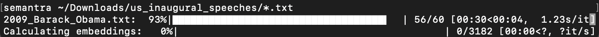

### Step 2: using the web app over document collections

When we launch the web app, we are greeted with a collection of documents.

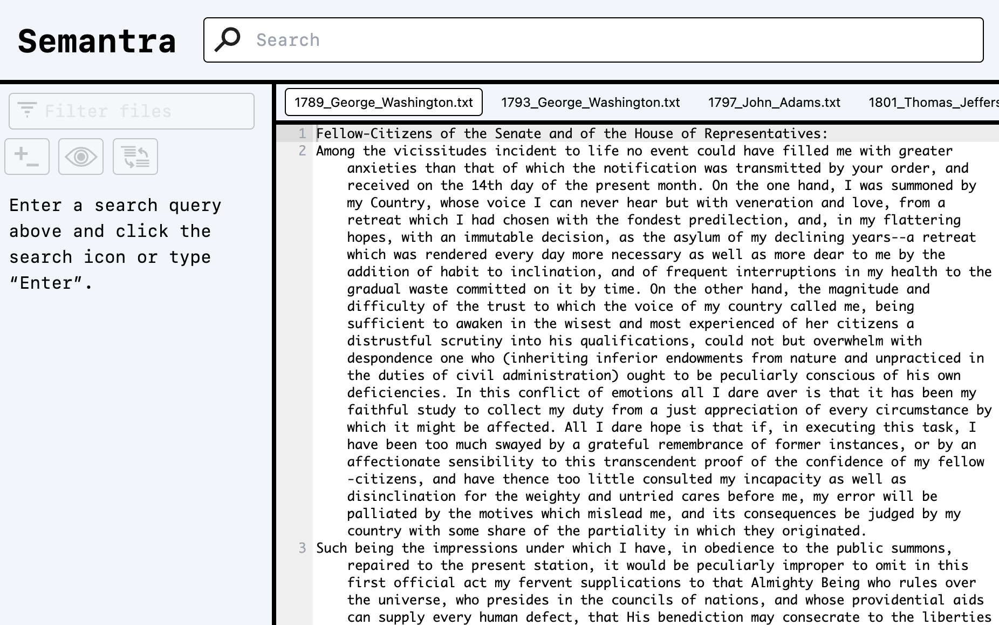

Note that we are viewing text documents and not PDFs, so the content window shows a text viewer.

The tab bar shows we're currently looking at George Washington's 1789 speech, and if we scroll right within the tab bar we can see all the files.

We can click on a tab to show that document's contents. For instance, here's what we see after clicking on `1865_Abraham_Lincoln.txt`:

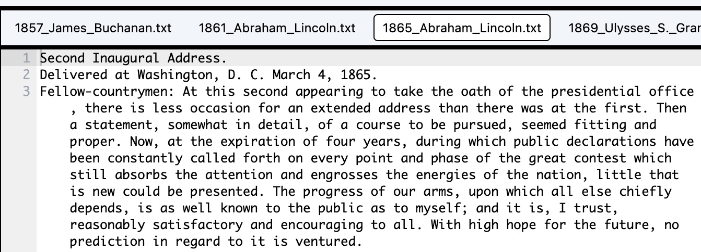

### Step 3: searching across documents

Let's try entering the search query "foreign policy" and pressing <kbd>Enter</kbd> or clicking the search icon.

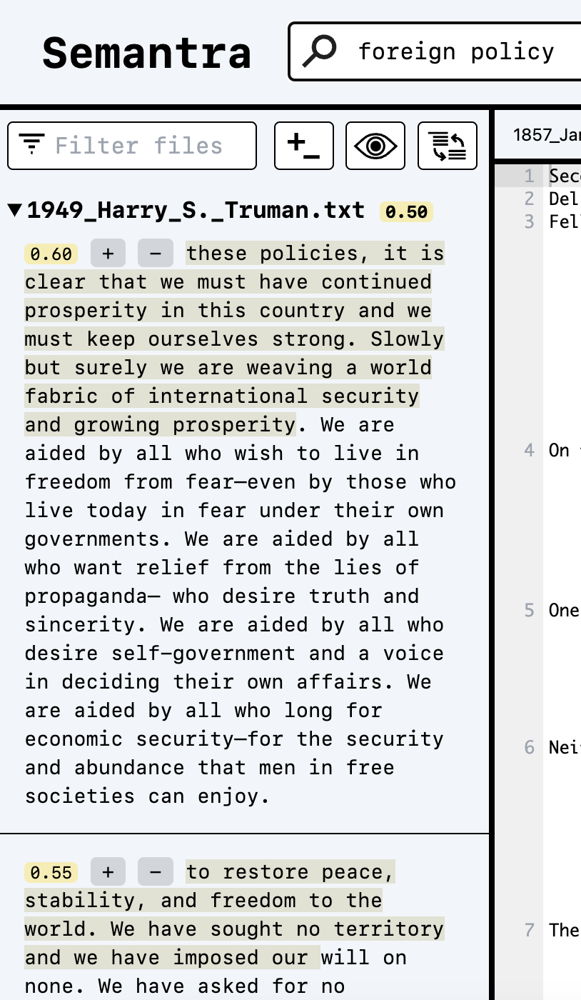

We get search results and Harry Truman's 1949 speech shows up first. We can collapse Truman's speech by clicking the dropdown arrow to the left of `1949_Harry_S._Truman.txt`:


Now, the next file's results are revealed. The search results are ordered by the most relevant documents as a whole to the query.

You can continue expanding and collapsing file names and scrolling to scan through results.

### Step 4: using the filter controls

There are three buttons at the top of the results pane that are useful for filtering and modifying the results views.


If you want to quickly collapse/expand search results, press the "+/-" button to toggle all the results at once:

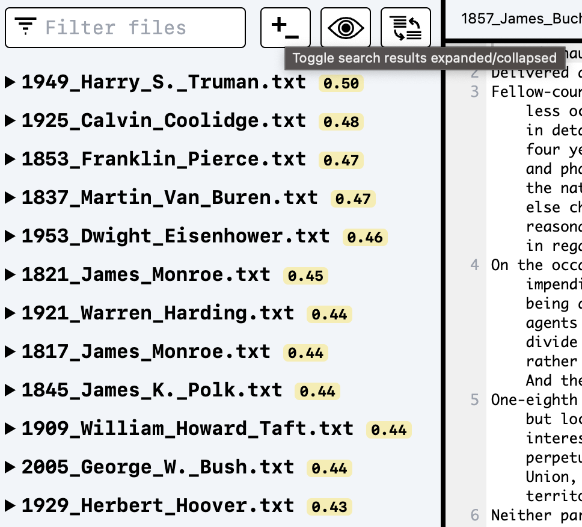

If we want to only show results for the document that we are currently viewing in the content window, we can press the eye button:


Notice, the eye button shows a grayed state to indicate it's filtering. Pressing the eye button again reveals all the documents again.

We may want to find the most relevant individual search results rather than documents. We can accomplish this by pressing the view switching button with two curved arrows:

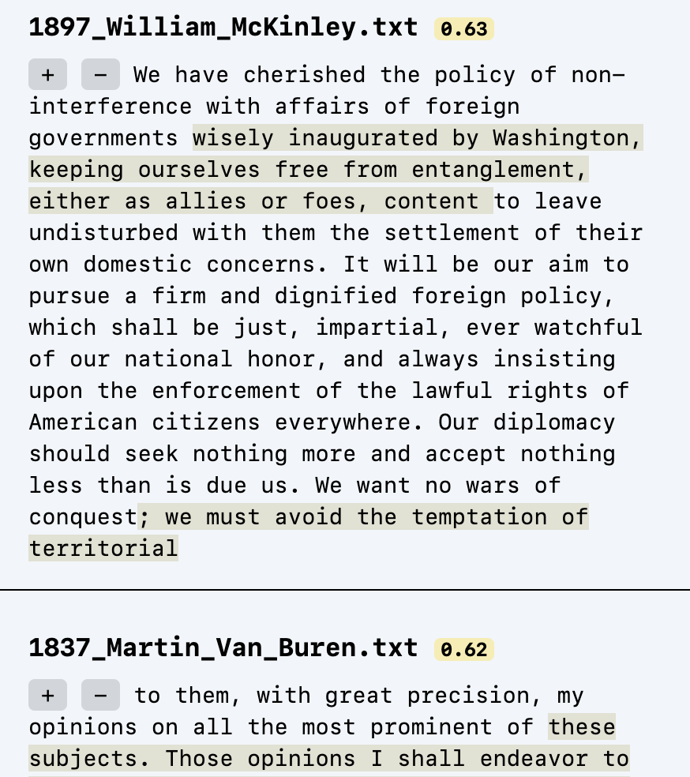

This removes the toggles and shows individual search results sorted by relevancy. Notice how the most relevant individual results are not necessarily from the most relevant documents. Pressing the view switching button again goes back to the collapsible file view.

Finally, we can filter which files are shown in search results by name using the filter text box. For instance, filtering to only show Monroe's speeches:

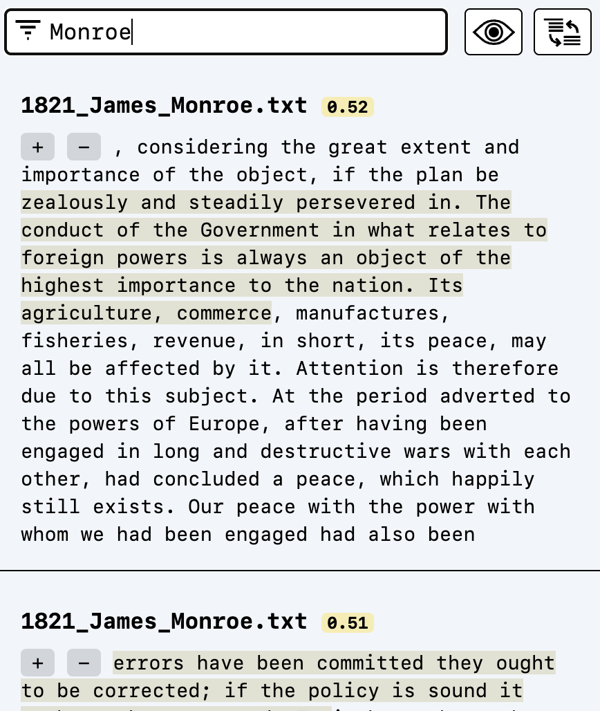

This text box updates instantly as you type, and clearing the text will reset the filter and show all results.

### Step 5: semantic arithmetic

Let's try querying "economic growth" and viewing by result rather than file:

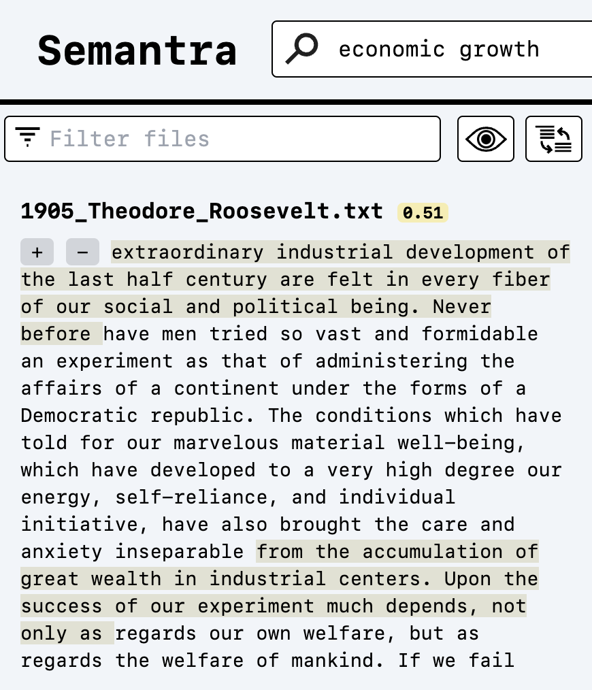

The first result seems pretty good, but what if we want to find instances of economic growth that are also talking about "unchecked capitalism."

We can do this by typing out the query: "economic growth + unchecked capitalism"

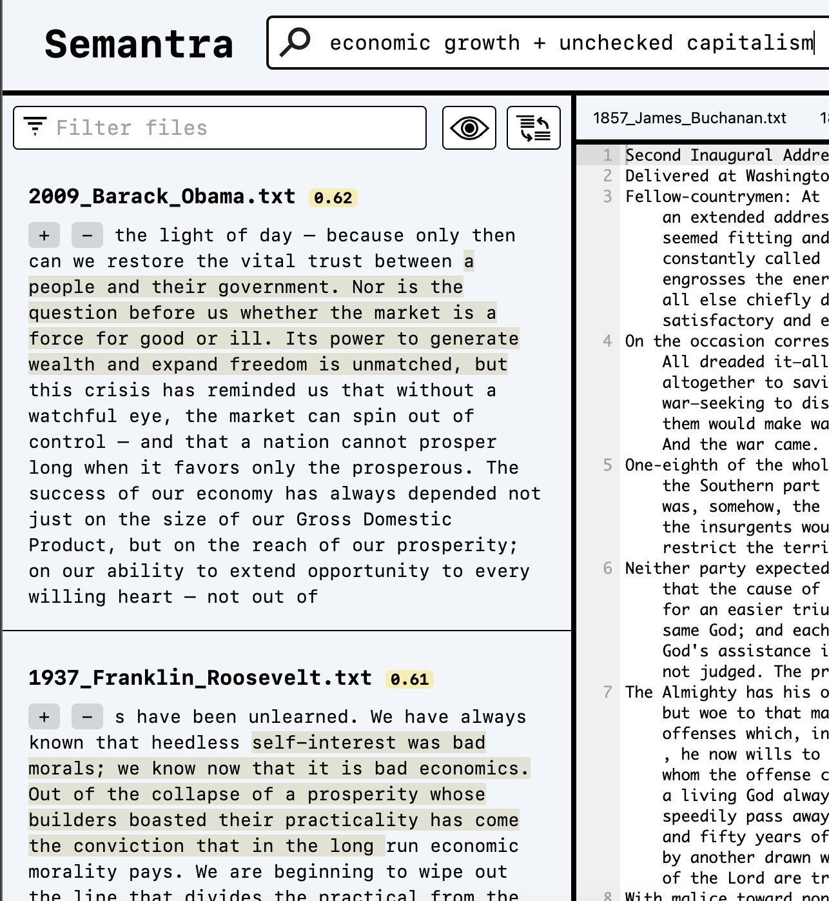

The "+" in the query text tells Semantra to add the semantic meanings of both "economic growth" and "unchecked capitalism" together and find the most relevant results for that combination.

What if instead of the combination we wanted examples of "economic growth" that don't mention anything related to "unchecked capitalism"? We can accomplish this with a minus sign instead of a plus sign in the query: "economic growth - unchecked capitalism"

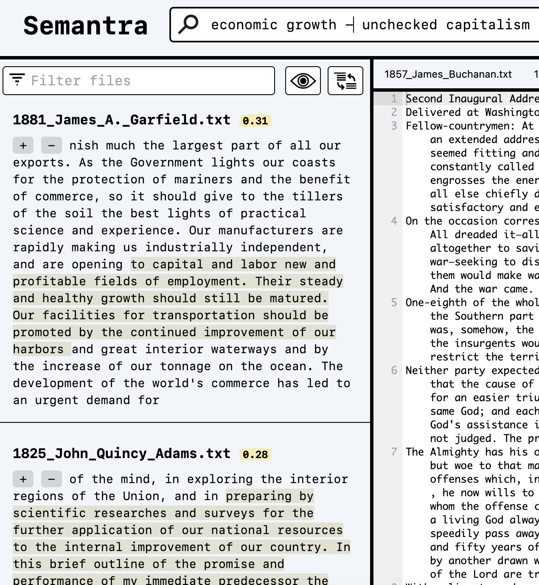

Let's refine further by adding in "war" to the equation: "economic growth - unchecked capitalism + war"

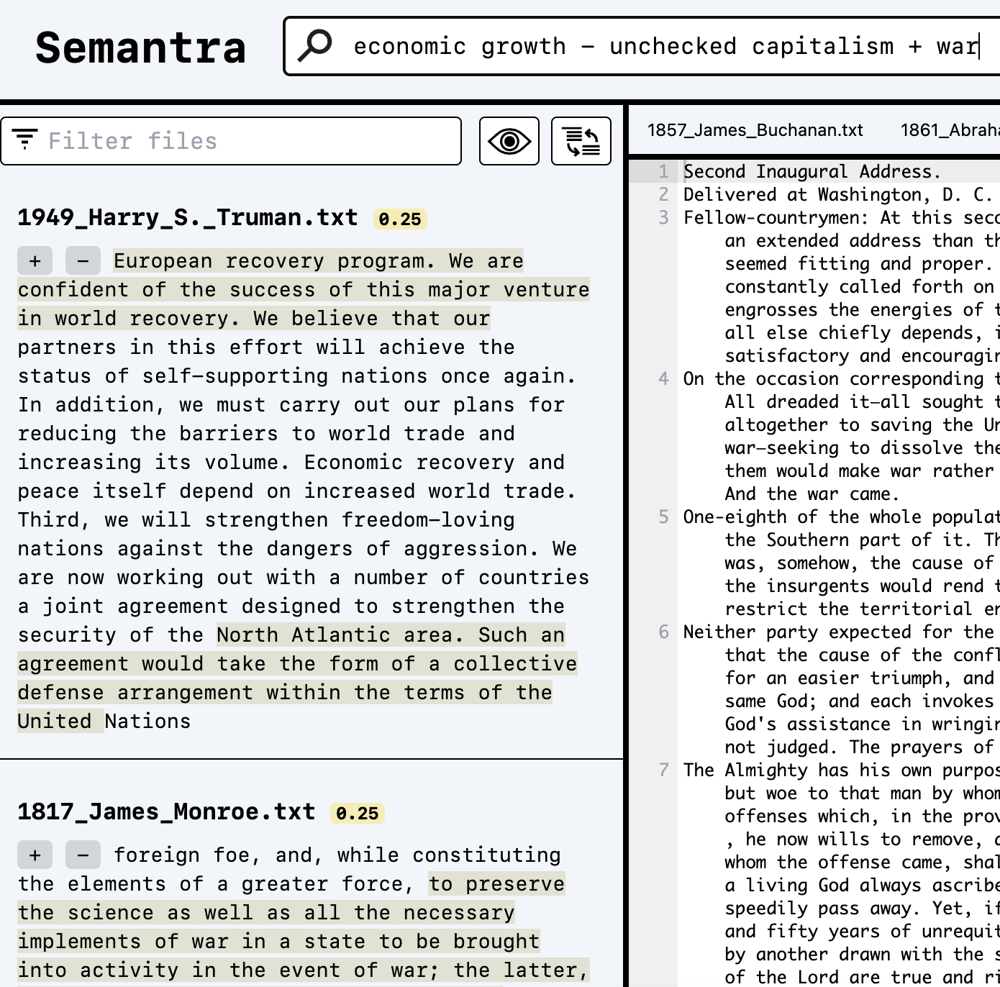

These results seem pretty relevant! As you can see, query arithmetic can help us more precisely shape the search and iterate within increasingly narrow windows of meaning to locate what we're looking for.

### Step 6: tagging search results

Sometimes it's useful to refine a search based on its results. For this, Semantra offers tagging, a way to positively and negatively label search results to further refine the query.

Let's try searching "healthcare for all":

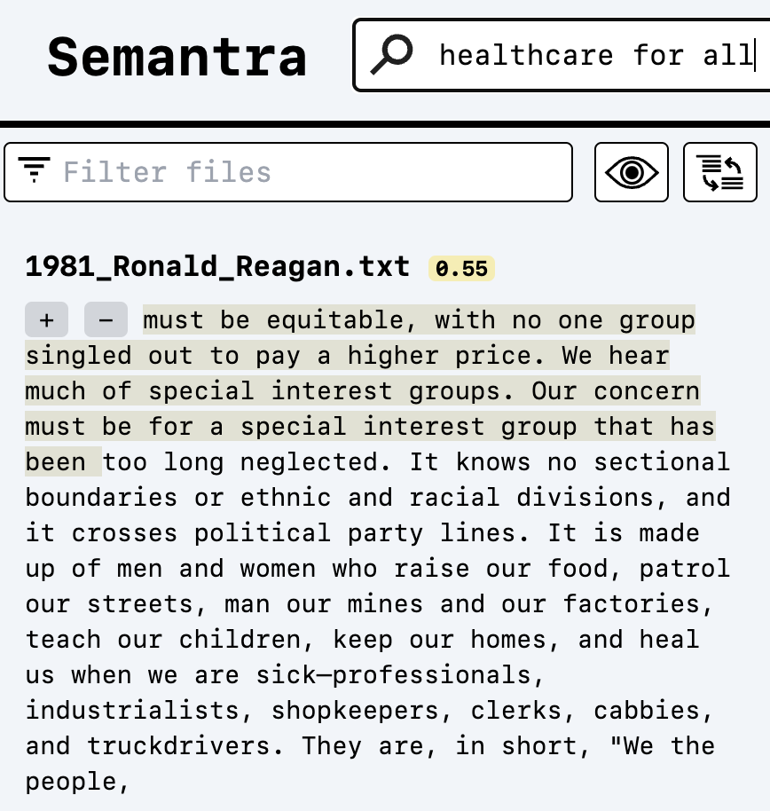

A speech by Reagan shows up that appears relevant. Click the "+" button next to the search result to tag it.


Notice the search bar appears a shade of yellow since the search has yet to be applied. The tag that will be applied shows below the search result. Click on the search icon or press <kbd>Enter</kbd> within the search box to launch the query.

It may look like the results are the same, but that's just because the search result we positively tagged still appears on the top. Scroll through some of the results to see if they're all relevant.

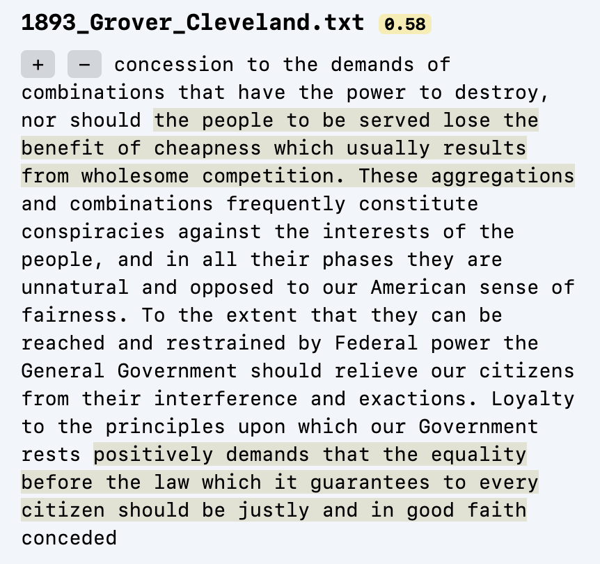

This one by Cleveland doesn't relate to healthcare that much. Let's negatively tag it by hitting the "-" button next to the result:

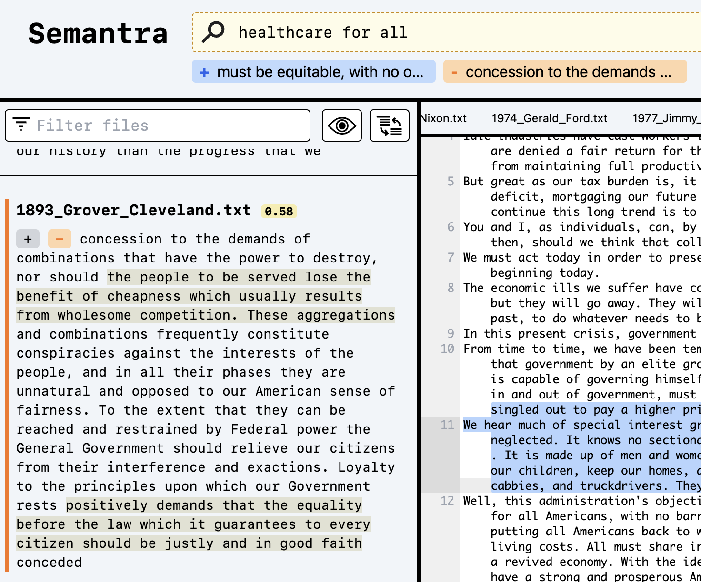

We can now re-run the query to see the new results that pop up.

To remove tags, click on them below the search bar.

### Step 8: have fun

We've essentially covered all of Semantra's features. The rest is up to you.

Some fun things you can try:

- enter negative queries, like "- freedom" and see what happens
- positively tag some results after querying something, then delete the query in the search box and hit enter. This will show results similar to the tagged results
- search for a concept like "diplomacy", positively tag a result, re-run the query, filter to only show results for a president that's not showing up in the top results

And so much more! If you find interesting or novel ways to use Semantra, let us know.

## Next steps

- Check out the [guides](guides.md)
- Learn about some relevant [concepts](concepts.md)
