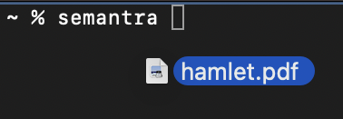
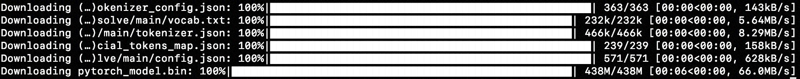
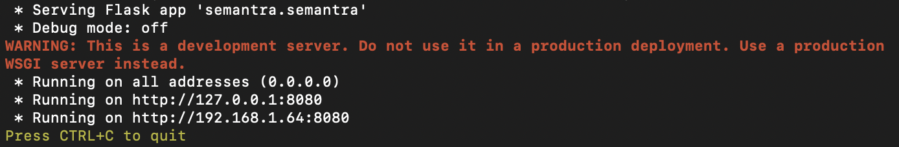
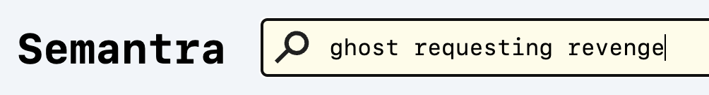
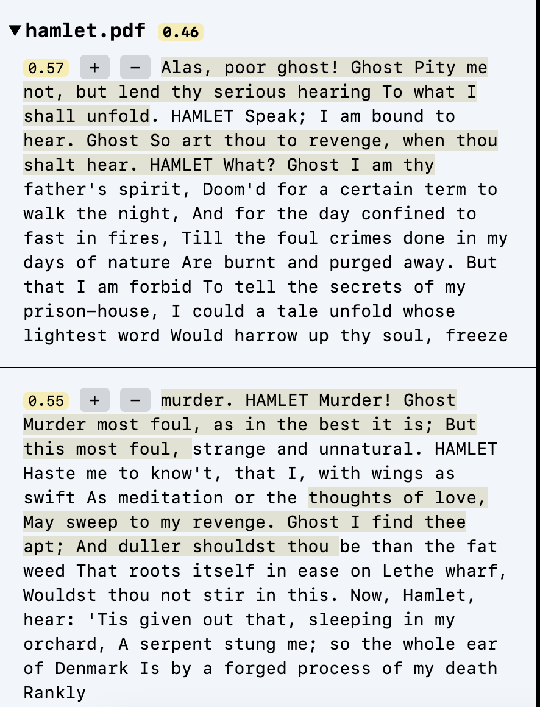
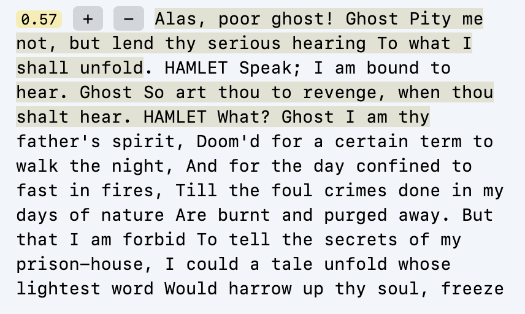
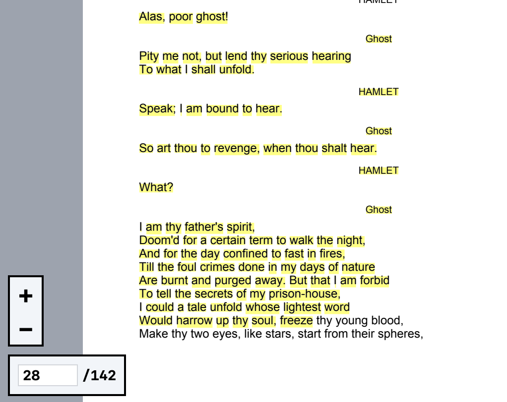

# Tutorial

This tutorial will walk through how to use Semantra with practical examples. It is recommended for new users of the tool.

## Installing

### Installing Python

Semantra is a command-line tool that is built with Python.

To install Semantra, you must first have Python installed, which you can accomplish in several ways:

- downloading from the [Python website](https://www.python.org/downloads/)
- via a package manager. For instance, if you have [Homebrew](https://brew.sh/) installed: `brew install python`

Open the terminal and verify Python is working via:

```sh
python --version
```

It is recommended to use Python 3.9 or greater.

If you need help installing Python, consult the sections on installing Python 3 from [this guide](https://docs.python-guide.org/starting/installation/).

### Installing Semantra

Once you have Python installed, you are ready to install Semantra. The most convenient way is via [pipx](https://packaging.python.org/en/latest/guides/installing-stand-alone-command-line-tools/). Run the following commands in the terminal:

```sh
python3 -m pip install --user pipx
python3 -m pipx ensurepath
```

Once `pipx` is installed, you may need to open a new terminal window for the changes to go into affect. Once you launch a new terminal window, Semantra can be installed globally via:

```sh
pipx install semantra
```

If you already have a working installation of Semantra and want to upgrade, you can run `pipx upgrade semantra`.

Once this command runs, verify that Semantra is installed by running the following in the terminal (it may take several seconds the first time it's run):

```sh
semantra
```

If all goes well, you'll get a print out to the terminal that looks like this:

```
Usage: semantra [OPTIONS] [FILENAME]...
Try 'semantra --help' for help.

Error: Must provide a filename to process/query
```

It's time to use the tool!

## "To be, or not to be": searching Shakespeare semantically

For the following lesson, we'll be exploring William Shakespeare's classic, [Hamlet](https://en.wikipedia.org/wiki/Hamlet).

### Step 1: prepare the document

Semantra operates on documents. To use the tool, you need to have any documents you wish to analyze downloaded and saved locally on your computer.

For this lesson, we'll be working with a PDF version of Hamlet, which you can download here: [hamlet.pdf (248 KB)](https://github.com/freedmand/semantra/raw/main/docs/example_docs/hamlet.pdf)

Save the document somewhere on your computer in a location you can remember. For this tutorial, we'll assume the document is stored in the default downloads folder on Mac OS X, `~/Downloads`, but your file's location may differ depending on where you save it.

### Step 2: run Semantra on Hamlet

Semantra is generally run via:

```sh
semantra <filenames>
```

where `<filenames>` is one or more files you wish to analyze. For this lesson, we'll only be analyzing a single file, `hamlet.pdf`:

```sh
semantra ~/Downloads/hamlet.pdf
```

Most terminals allow dragging files into the window to auto-fill the complete path of the file. You can type `semantra ` (with a space at the end) and then drag the file from your computer over the terminal and release it to populate the full name.



Press <kbd>Enter</kbd> to run Semantra!

### Step 3: wait for processing to complete

The first time Semantra runs, it takes additional time to download any machine learning models it needs. This may take several minutes and several hundreds of megabytes of disk space to store the models.



Once any needed models are downloaded, Semantra will begin processing. It first extracts the text content out of the PDF and then calculates embeddings.


More on what embeddings are and how to use them effectively in the next lesson.

Once processing is complete, which may take several minutes, a local web server is launched:



From the output, we can see that the web server has started and is running at several URLs. Navigate to one of them, e.g. http://127.0.0.1:8080, to launch the Semantra web app.

### Step 4: semantically searching Shakespeare

After opening your web browser to the URL http://127.0.0.1:8080, you should see the Semantra web interface:


The interface is divided into four main sections:

- **search bar**: the top of the website where a long search bar runs across. This is where the main searching happens
- **results pane**: the left sidebar. This is where search results show up
- **tab bar**: shows all the files and highlights which one is loaded in the content window
- **content window**: displays a browseable document


Let's run a query! Type in "ghost seeking revenge" in the search bar.



You'll notice the search bar turns a tint of yellow as you begin typing. That means that the query hasn't yet been run and whatever results you see may be stale.

Press <kbd>Enter</kbd> or click the search icon to run the query. Search results should appear!



Let's break down what's going on. First, we see `hamlet.pdf` and a score (0.46):


This indicates the results below are all for `hamlet.pdf`, which is obvious since we're only working with one file but helpful with larger collections.

The score 0.46 is out of 1. A score of 0 indicates no semantic similarity whatsoever. A score of 1 indicates an exact semantic match. Unlike regular search engines, a score of 0.46 is pretty good semantically! The score shown here is the average for all of this file's search results.



Below the file header, we have our search results. The first result shows 0.57, indicating the score for that result. There are "+" and "-" buttons, which we will come back to later. Then, the text of the matching search result.

You may notice some regions of the text are highlighted within the result, and those highlights stream in a bit slower. Semantra tries to explain the most relevant parts of each result to the search query. These highlights help direct your attention to what may be the most relevant.

Click on the search result to get the content window to jump to the relevant part of the document and highlight the result.



Congrats! You have just done your first semantic query. Try some other ones out on your own. Here's some good queries for Hamlet and useful observations:

- `musings about life`
- `talking to a skull`
- `stabbing with a knife`

Note that results for semantic searches are a bit different than traditional searches. It takes some getting used to, but there are also powerful tools to refine the results.

### Step 5: a brief aside on embeddings

You'll need a base level of understanding about _embeddings_ to effectively work with Semantra. At its core, embeddings are numerical representations of meaning. And embedding models are machine learning models that take in text (or other media) and output these numerical embeddings.

Text embedding models are typically trained on terabytes of text encompassing many genres. From that data they become skilled at encoding text into meaning by inferring patterns.

It is helpful to imagine working with embeddings in Semantra as _sculpting_ in the domain of meaning.

Embeddings can be hundreds or even thousands of dimensions long, which sounds pretty confusing. But it can be helpful to visualize them as bar charts, where each dimension is a bar.

Since embeddings are entirely numerical, you can do mathematical operations on them, with some pretty surprising implications. For example, if you take the embedding for `queen`, `king`, `woman`, and `man`, you can do arithmetic like `king - man + woman` and end up with a result that's pretty close to the embedding for `queen`.


